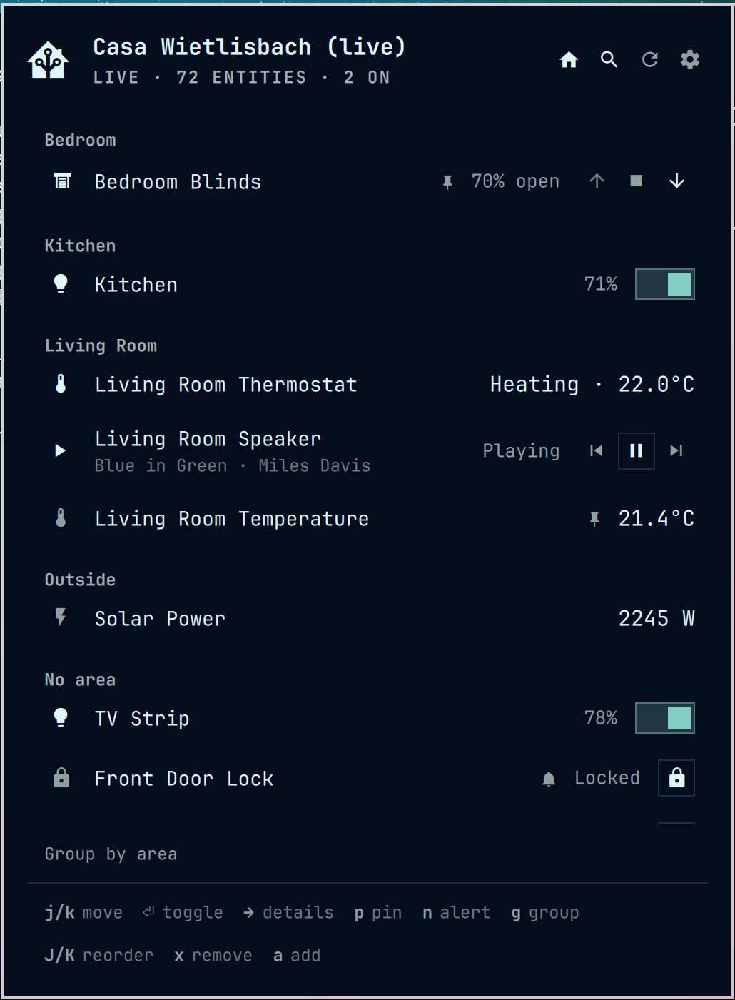
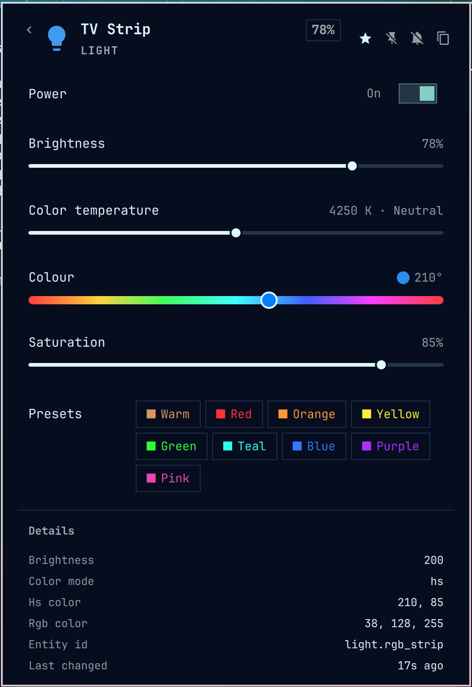
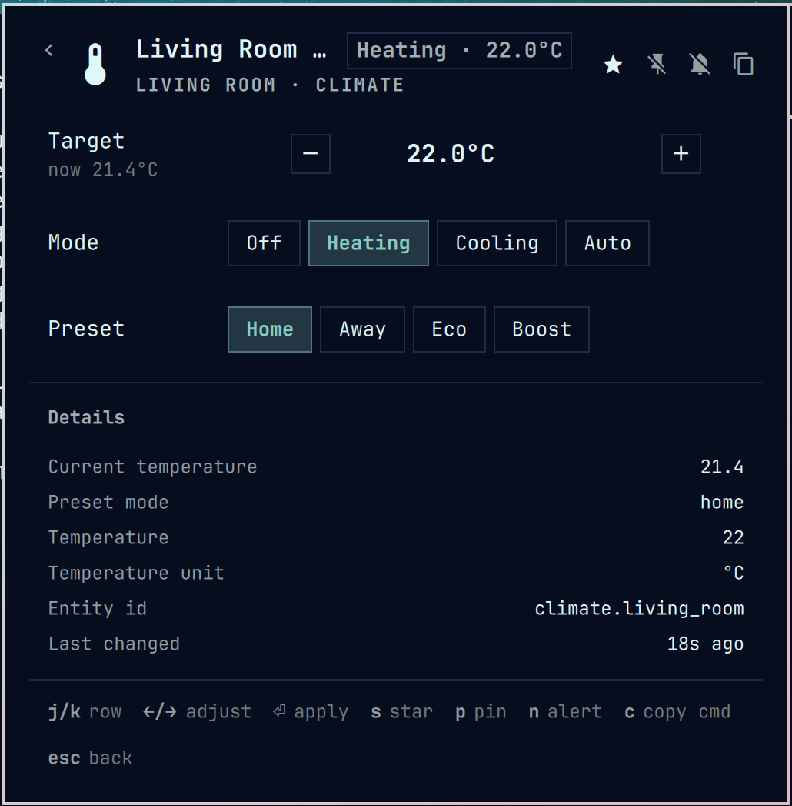
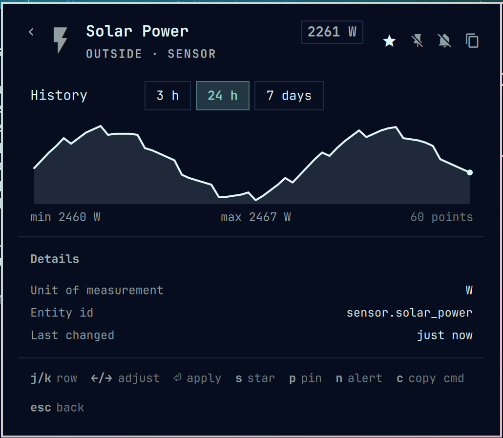
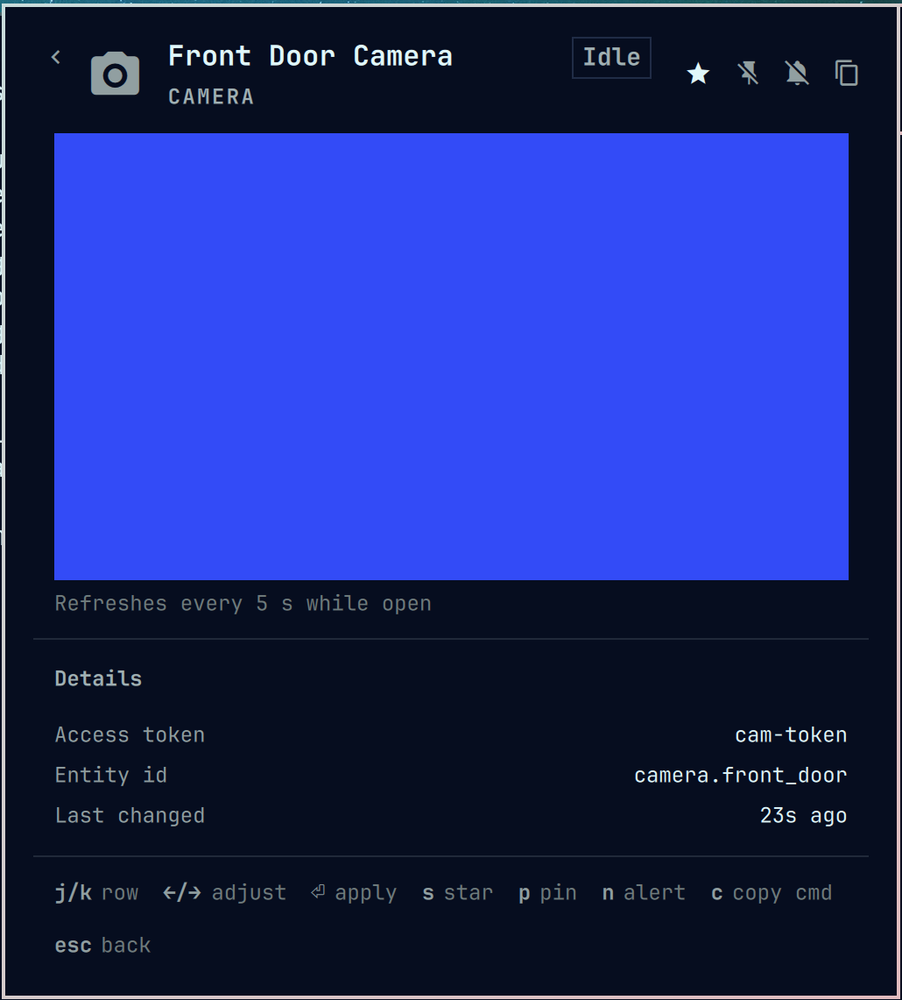
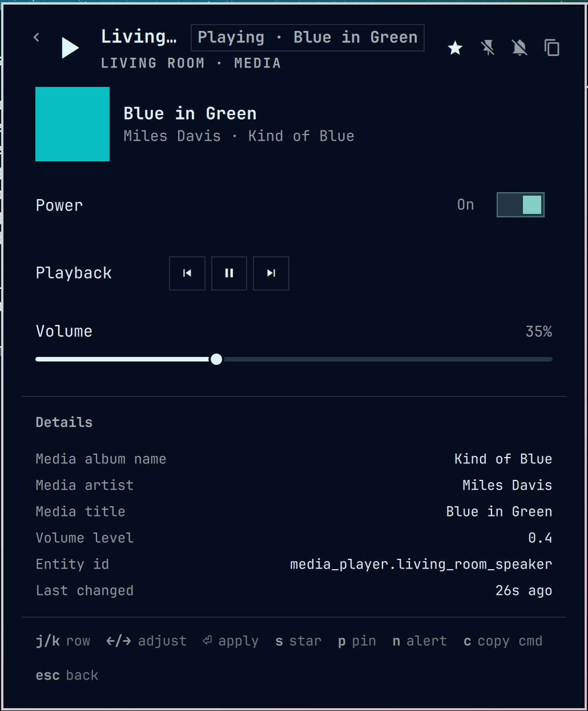
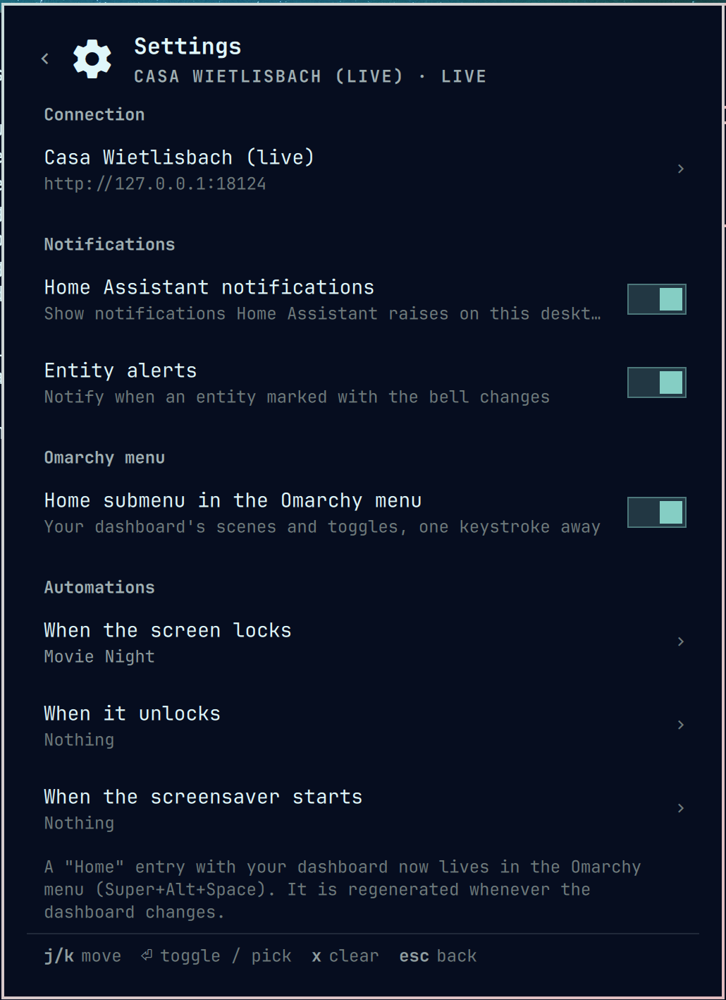

# Home Assistant for Omarchy

Home Assistant in the Omarchy bar. A pill that shows the entities you pin,
a keyboard-first panel where you browse every entity in your home and star
the ones you want, and a shell service that keeps one live connection open
for notifications, the Omarchy menu, and presence automations.

<p align="center"></p>

## What it does

- **Dashboard** of the entities you picked, in the order you chose: drag rows
  with the mouse or move them with `J` / `K`. Group it by area, by type, or
  by status (`g`) with section headers. Lights and switches get a toggle,
  covers get open/stop/close, media players get transport buttons, locks lock
  and unlock, scenes and scripts run, sensors show their value. Toggles flip
  immediately and reconcile with the real state.
- **Browser** with instant search across every entity, category chips, and
  area names. Star a row to add it to the dashboard.
- **Detail view** per entity: brightness, colour temperature, a hue bar,
  saturation and colour presets for lights; target temperature, mode and
  preset for climate; position for covers; volume, transport and album art
  for media; speed for fans; options for selects; and every attribute.
- **Camera snapshots** in the detail view, refreshed every five seconds
  while open.
- **History sparklines** for numeric sensors, with 3 hour, 24 hour and
  7 day ranges and min/max.
- **Pin to bar**: any number of entities, their states next to the icon
  ("21.4° · Closed"). The pill turns urgent when a pinned entity goes
  unavailable or a smoke, gas, water, or alarm entity you watch fires.
- **Alerts**: mark an entity with the bell and get an Omarchy notification
  when it changes, worded for its device class ("Front Door · Opened",
  "Hallway Motion · Motion detected"). Click the notification to open it.
- **Home Assistant notifications** raised on the server show up on your
  desktop too.
- **Omarchy menu**: one toggle adds a "Home" submenu with your dashboard to
  the Omarchy menu. Toggles show a check mark when they are on. It is
  regenerated whenever the dashboard changes.
- **Automations**: run a scene or script when the screen locks, unlocks, or
  the screensaver starts. Picked in the panel, no YAML.
- **Live**: one WebSocket connection per shell, shared by every bar
  instance, with instant state pushes and automatic reconnect. Falls back to
  REST polling when the `qt6-websockets` package is missing and offers to
  install it.
- **Themed**: colors, fonts and spacing come from the Omarchy theme.

| Browser | Grouped by area | Colour |
|---|---|---|
|  |  |  |

| Climate | History | Camera |
|---|---|---|
|  |  |  |

| Media | Settings | First run |
|---|---|---|
|  |  |  |

| Omarchy menu | Notifications |
|---|---|
|  |  |

All screenshots come from the mock instance in `test/`, not a real home.

## Install

```bash
omarchy plugin add https://github.com/rewisch/omarchy-homeassistant.git --enable
```

Then click the house icon in the bar. Enter the address of your instance
and a long-lived access token (Home Assistant → your profile → Security →
Long-lived access tokens) and press Connect. Press `a` to browse, type to
search, `Enter` to star, `Esc` to return to the dashboard.

For live updates instead of polling, press **Install** on the "Get live
updates" banner the dashboard shows on first connect (or press `L`). It opens
Omarchy's floating terminal, installs `qt6-websockets` through
`omarchy pkg add`, and restarts the shell. The plugin itself never elevates
privileges; the package install happens in that terminal, in front of you,
only when you press the button. The manual equivalent:

```bash
omarchy pkg add qt6-websockets
omarchy restart shell
```

## Dependencies

- Part of every Omarchy install, nothing to add: `curl` (REST fallback and
  connection check), `wl-copy` (copy command), `omarchy-notification-send`
  (notifications), `omarchy-shell` (IPC).
- Optional: `qt6-websockets` for the live WebSocket transport. Without it the
  plugin polls over REST.
- No sudo or pkexec is required by the plugin.

## Removal

```bash
omarchy plugin remove rewisch.homeassistant
rm -rf ~/.config/omarchy/homeassistant        # connection, dashboard, preferences
```

If you enabled the Home submenu, turn it off in the panel's settings before
removing the plugin, or delete the block between the
`// >>> rewisch.homeassistant` and `// <<< rewisch.homeassistant` markers in
`~/.config/omarchy/extensions/omarchy-menu.jsonc`. The plugin never touches
anything else.

Your connection is saved to `~/.config/omarchy/homeassistant/connection.json`
with owner-only permissions. The dashboard, pins, alerts and preferences live
next to it in `dashboard.json`. Nothing is written anywhere else unless you
turn on the Home submenu in settings.

## Keyboard

Dashboard:

| Key | Action |
|---|---|
| `j` / `k` or arrows | move |
| `Enter` / `Space` | toggle, run, or open details |
| `→` / `l` / `e` | details |
| `p` | pin to bar |
| `n` | notify me when this changes |
| `g` | cycle grouping: none, area, type, status |
| `J` / `K` or mouse drag | reorder (when not grouped) |
| `x` / `d` | remove from dashboard |
| `a` / `/` | browse entities |
| `r` | refresh |
| `,` | settings |
| `Esc` | close |

Browser:

| Key | Action |
|---|---|
| type | search |
| `↑` / `↓` (or `Ctrl-j` / `Ctrl-k`) | move |
| `Enter` | star / unstar (or choose, when picking) |
| `Tab` / `Shift-Tab` | next / previous category |
| `→` (at end of text) | details |
| `Ctrl-Enter` | toggle the entity |
| `Ctrl-Space` | pin to bar |
| `Esc` | clear search, then back |

Details:

| Key | Action |
|---|---|
| `j` / `k` | move between controls |
| `←` / `→`, `-` / `+` | adjust slider, hue, stepper or chip |
| `Enter` | apply the highlighted chip |
| `t` | toggle power |
| `s` | star / unstar |
| `p` | pin / unpin |
| `n` | alert on / off |
| `c` | copy the shell command for a keybinding |
| `Esc` / `h` | back |

Settings (`,`): `j` / `k` move, `Enter` toggles or opens the picker,
`x` clears an automation.

Bar pill: left click opens the panel, right click toggles the first pinned
entity (or refreshes), middle click refreshes.

## Keybindings and scripting

Every action is reachable over the shell IPC. Press `c` on any entity's
detail view to copy its command, then bind it in
`~/.config/hypr/bindings.lua`:

```lua
o.bind("SUPER SHIFT, H", "omarchy-shell rewisch.homeassistant toggle", "Home Assistant")
o.bind("SUPER SHIFT, L", "omarchy-shell rewisch.homeassistant toggleEntity light.desk", "Desk light")
```

Available methods:

```bash
omarchy-shell rewisch.homeassistant toggle                 # open / close the panel
omarchy-shell rewisch.homeassistant browse
omarchy-shell rewisch.homeassistant settings
omarchy-shell rewisch.homeassistant detail climate.living_room
omarchy-shell rewisch.homeassistant toggleEntity light.kitchen
omarchy-shell rewisch.homeassistant turnOn scene.movie_night
omarchy-shell rewisch.homeassistant turnOff switch.garden_pump
omarchy-shell rewisch.homeassistant call cover.open_cover cover.garage
omarchy-shell rewisch.homeassistant state sensor.living_room_temperature
omarchy-shell rewisch.homeassistant refresh
```

## Settings

Inside the panel (`,`): connection, notifications, the menu block, and
automations. In `Setup → Plugins` or the widget entry in
`~/.config/omarchy/shell.json`: `transport` (`Auto`, `WebSocket`, `Polling`)
and `refreshIntervalSec` for polling.

## Layout

```
manifest.json      plugin manifest: service + bar widget, settings schema
Panel.qml          bar pill, popup, view routing, IPC
Service.qml        shared connection, entity store, actions, notifications,
                   menu block, automations, persistence
WsTransport.qml    WebSocket transport (needs qt6-websockets)
RestTransport.qml  curl-based polling transport
Model.js           pure helpers: icons, state text, search, groups
HomeView.qml       dashboard
BrowseView.qml     search, pick, star
DetailView.qml     per-entity controls and attributes
SettingsView.qml   notifications, menu, automations
SetupView.qml      connection editor
EntityRow.qml      shared list row
HintBar.qml        keyboard hint footer
test/              mock Home Assistant servers for development
```

## Development

Clone into `~/src`, symlink it into the plugins directory, and restart the
shell after editing (hot reload keeps the cached QML):

```bash
git clone https://github.com/rewisch/omarchy-homeassistant.git ~/src/omarchy-homeassistant
ln -s ~/src/omarchy-homeassistant ~/.config/omarchy/plugins/rewisch.homeassistant
omarchy plugin enable rewisch.homeassistant
omarchy restart shell
```

See `test/README.md` for the mock servers.
